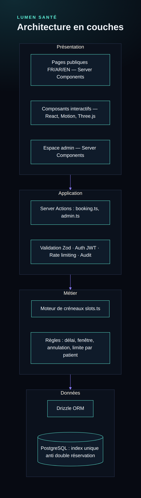

# Lumen Santé — site premium pour cabinet médical

Site vitrine + prise de rendez-vous en ligne + espace d'administration pour un cabinet médical
ou un centre multi-spécialités. Le même code s'adapte à chaque client (dentiste, ophtalmologue,
psychiatre, centre pluridisciplinaire…) depuis un seul fichier : `src/config/clinic.ts`.

> Marque fictive, site de démonstration. Les médecins du jeu de données sont inventés.



## Fonctionnalités

**Site public (FR / AR en RTL / EN)**
- Accueil premium : intro animée, 3D en particules, boutons magnétiques, titres révélés au scroll
- 3D de particules qui suit le scroll : sphère → dent, œil, cerveau, peau, ourson, cœur (une forme par spécialité) → ADN
- Spécialités épinglées au scroll, galerie photo horizontale avec parallaxe, compteurs animés, bandeaux défilants
- Photos dans `public/images` (provisoires : voir `public/images/README.md`)
- Spécialités, équipe médicale, parcours patient, informations pratiques
- Prise de rendez-vous en 3 étapes : spécialité et médecin (ou « premier disponible ») → jour et heure → coordonnées
- E-mail de confirmation avec lien d'annulation sécurisé

**Espace cabinet (`/admin`)**
- Tableau de bord : rendez-vous du jour, en attente, à venir
- Rendez-vous : filtres, confirmer / annuler / terminé / absent
- Médecins : fiche trilingue, horaires hebdomadaires, absences et congés
- Spécialités : durée de consultation, activation
- Contenu du site : logo, nom, couleurs, coordonnées, tous les textes (FR/AR/EN), spécialités, photos du centre, chiffres, SEO, e-mails — avec bouton « Rétablir l'original »
- Paramètres : règles de réservation, comptes du personnel, journal d'activité
- Deux rôles : **ADMIN** (tout) et **STAFF** (rendez-vous uniquement)

## Stack

| Couche | Choix |
|---|---|
| Framework | Next.js 16 (App Router, Server Components, Server Actions), React 19, TypeScript |
| Interface | Tailwind CSS v4, Motion, Lenis, React Three Fiber, lucide-react |
| Données | PostgreSQL + Drizzle ORM (migrations SQL versionnées) |
| Sécurité | bcrypt, sessions JWT signées (jose) en cookie HttpOnly, Zod, limitation de débit, CSP |
| E-mails | Resend (API HTTP) |
| Hébergement | Vercel + Neon (PostgreSQL) |

## Lancer en local

Prérequis : Node.js 20.12+ et Docker (ou un PostgreSQL existant).

```bash
docker compose up -d          # PostgreSQL local sur 127.0.0.1:54320
cp .env.example .env          # puis remplir AUTH_SECRET et ADMIN_PASSWORD
npm install
npm run db:migrate            # crée les tables
npm run db:seed               # spécialités, médecins de démo, compte admin
npm run dev                   # http://localhost:3000
```

- Site : `http://localhost:3000/fr` (ou `/ar`, `/en`)
- Espace cabinet : `http://localhost:3000/admin` avec `ADMIN_EMAIL` / `ADMIN_PASSWORD`
- Sans `RESEND_API_KEY`, les e-mails s'affichent dans le terminal au lieu d'être envoyés.

### Variables d'environnement

| Variable | Rôle |
|---|---|
| `DATABASE_URL` | Connexion PostgreSQL. Sur Neon : l'URL **poolée** (`-pooler` dans l'hôte, `?sslmode=require`) |
| `DATABASE_URL_UNPOOLED` | Optionnel : URL directe Neon, utilisée seulement par les migrations |
| `DB_POOL_MAX` | Optionnel : connexions par instance serveur (3 par défaut, adapté au serverless) |
| `AUTH_SECRET` | Clé de signature des sessions et de chiffrement des secrets 2FA, 32 caractères minimum. La changer déconnecte tout le monde et oblige à réactiver la double authentification |
| `ADMIN_EMAIL`, `ADMIN_PASSWORD`, `ADMIN_NAME` | Premier administrateur créé par le seed (mot de passe ≥ 12 caractères) |
| `SEED_DEMO` | `false` pour ne pas créer les médecins de démonstration |
| `NEXT_PUBLIC_SITE_URL` | URL publique (liens des e-mails, sitemap) |
| `RESEND_API_KEY`, `EMAIL_FROM` | Envoi des e-mails (optionnel en local) |

## Adapter à un nouveau client

1. `src/config/clinic.ts` : nom, ville, adresse, téléphone, horaires, fuseau, couleurs, liste des spécialités.
2. `src/dictionaries/specialties.ts` : textes et prestations de chaque spécialité.
3. `npm run db:seed` avec `SEED_DEMO=false`, puis ajout des vrais médecins depuis `/admin/medecins`.

## Scripts

| Commande | Rôle |
|---|---|
| `npm run dev` / `build` / `start` | Développement, build de production, serveur |
| `npm run typecheck` | Vérification TypeScript |
| `npm run db:generate` | Génère une migration après modification de `src/db/schema.ts` |
| `npm run db:migrate` | Applique les migrations |
| `npm run db:seed` | Données initiales |
| `npm run db:studio` | Explorateur de base Drizzle |
| `npm run lint` | Analyse ESLint |
| `npm test` | Tests unitaires (Vitest) : moteur de créneaux, fuseau horaire, sécurité du CMS |
| `npm run test:e2e` | Tests de bout en bout (Playwright) : parcours, sécurité, accessibilité, responsive |
| `npm run clean` | Vide le cache de build `.next` |

### Tests de bout en bout

```bash
npx playwright install chromium   # une seule fois
npm run build
npm run test:e2e                  # démarre le site sur le port 3100 et lance ~50 scénarios
```

Les tests écrivent dans la base de `DATABASE_URL` (rendez-vous et comptes `e2e+…@lumen.test`, supprimés à la fin) :
à lancer sur la base locale, jamais sur la production.

## Déploiement (Vercel + Neon)

1. Créer une base sur Neon en région Europe (Francfort), copier l'URL **poolée** et l'URL directe.
2. Importer le dépôt GitHub dans Vercel, renseigner les variables ci-dessus. Les fonctions tournent à Francfort (`vercel.json`), près de la base.
3. Depuis son poste, avec les URL de Neon : `npm run db:migrate` puis `npm run db:seed`.
4. Resend : vérifier le domaine d'envoi, puis renseigner `RESEND_API_KEY` et `EMAIL_FROM`.
5. Après le premier déploiement : se connecter à `/admin`, changer le mot de passe (Mon compte), remplir le contenu (Contenu du site).

### Tenue de charge

- Pages publiques pré-générées et servies par le CDN ; elles se régénèrent seules quand le contenu change.
- Disponibilités lues via `/api/availability` et `/api/slots`, mises en cache au CDN (10 à 30 s) et invalidées à chaque réservation : des milliers de visiteurs simultanés coûtent quelques requêtes SQL par minute.
- Chaque réservation est revérifiée en base ; une contrainte d'exclusion PostgreSQL rend le double-booking impossible, même sous forte concurrence.
- Limites connues : pas de CAPTCHA (limitation par réseau, pot de miel et verrou par e-mail à la place) ; CSP avec `unsafe-inline` pour les scripts de Next.js.

## Structure

```
src/
  config/clinic.ts        configuration du client
  app/[lang]/             pages publiques (fr, ar, en)
  app/admin/              espace cabinet (login + panneau)
  app/actions/            Server Actions : booking.ts, admin.ts
  lib/                    auth, créneaux, fuseau horaire, limitation de débit, e-mail
  db/                     schéma Drizzle + connexion
  components/             sections, réservation, 3D, admin
drizzle/                  migrations SQL
scripts/seed.ts           données initiales
docs/                     diagrammes UML (Mermaid + PNG/SVG)
DECISIONS.md              règles métier et choix techniques
```

## Documentation

- [Diagrammes](docs/diagrams.md) : cas d'utilisation, modèle de données, séquence de réservation, déploiement, architecture
- [Rapport de recette](docs/rapport-qa.md) : tests, charge, anomalies corrigées, limites connues
- [Réponse aux audits externes](docs/reponse-audits.md) : chaque remarque, ce qui a été corrigé, ce qui reste à faire avant un vrai client
- [DECISIONS.md](DECISIONS.md) : chaque règle métier et chaque choix technique, avec sa justification
