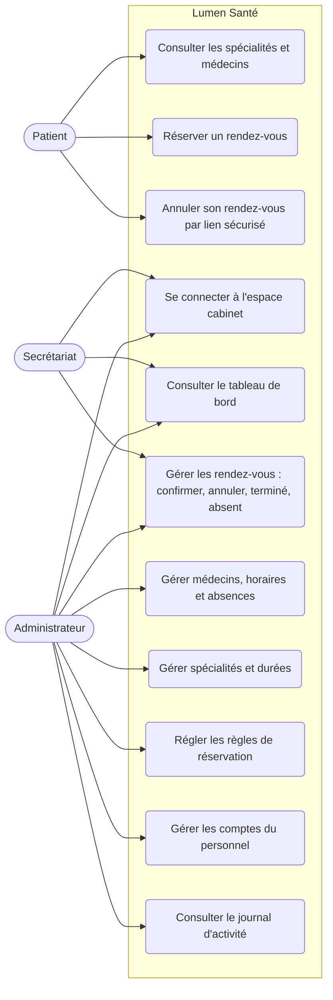
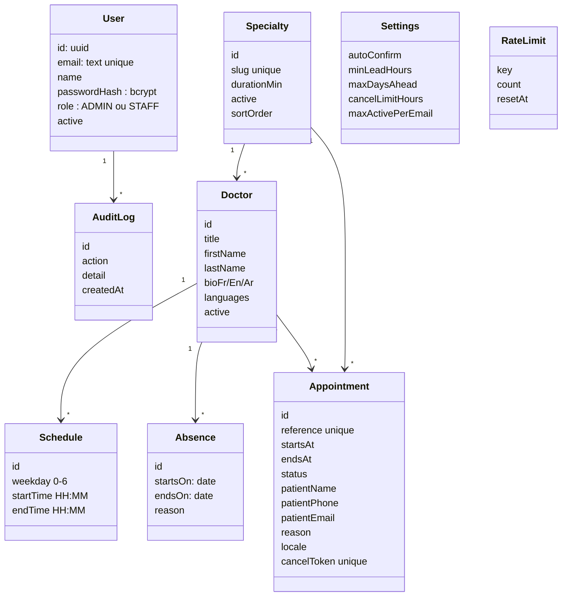
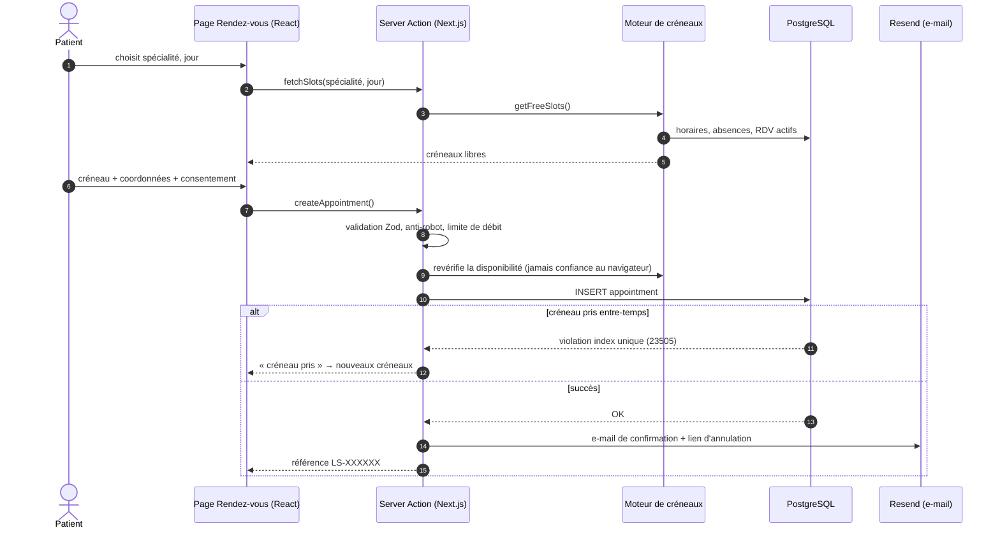
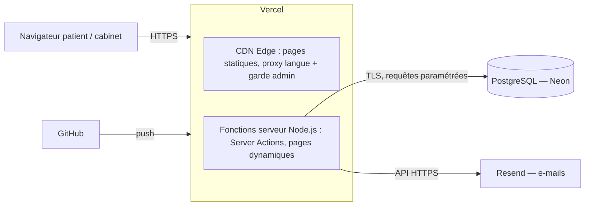
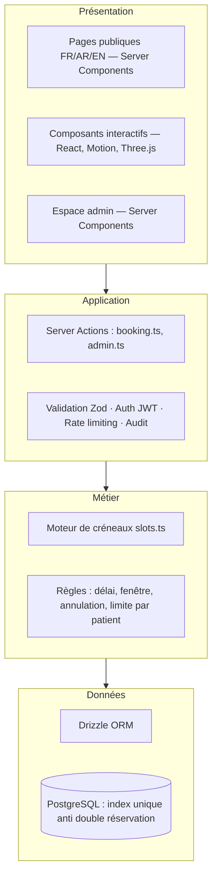

# Lumen Santé — Diagrammes

## 1. Cas d'utilisation

```mermaid
flowchart LR
  P([Patient])
  S([Secrétariat])
  A([Administrateur])
  subgraph Site["Lumen Santé"]
    UC1(Consulter les spécialités et médecins)
    UC2(Réserver un rendez-vous)
    UC3(Annuler son rendez-vous par lien sécurisé)
    UC4(Se connecter à l'espace cabinet)
    UC5(Consulter le tableau de bord)
    UC6(Gérer les rendez-vous : confirmer, annuler, terminé, absent)
    UC7(Gérer médecins, horaires et absences)
    UC8(Gérer spécialités et durées)
    UC9(Régler les règles de réservation)
    UC10(Gérer les comptes du personnel)
    UC11(Consulter le journal d'activité)
  end
  P --> UC1 & UC2 & UC3
  S --> UC4 & UC5 & UC6
  A --> UC4 & UC5 & UC6 & UC7 & UC8 & UC9 & UC10 & UC11
```

## 2. Modèle de données (classes)

```mermaid
classDiagram
  direction TB
  class User {
    id: uuid
    email: text unique
    name
    passwordHash : bcrypt
    role : ADMIN ou STAFF
    active
  }
  class Specialty {
    id
    slug unique
    durationMin
    active
    sortOrder
  }
  class Doctor {
    id
    title
    firstName
    lastName
    bioFr/En/Ar
    languages
    active
  }
  class Schedule {
    id
    weekday 0-6
    startTime HH:MM
    endTime HH:MM
  }
  class Absence {
    id
    startsOn: date
    endsOn: date
    reason
  }
  class Appointment {
    id
    reference unique
    startsAt
    endsAt
    status
    patientName
    patientPhone
    patientEmail
    reason
    locale
    cancelToken unique
  }
  class Settings {
    autoConfirm
    minLeadHours
    maxDaysAhead
    cancelLimitHours
    maxActivePerEmail
  }
  class AuditLog {
    id
    action
    detail
    createdAt
  }
  class RateLimit {
    key
    count
    resetAt
  }
  Specialty "1" --> "*" Doctor
  Doctor "1" --> "*" Schedule
  Doctor "1" --> "*" Absence
  Doctor "1" --> "*" Appointment
  Specialty "1" --> "*" Appointment
  User "1" --> "*" AuditLog
```

## 3. Séquence — réservation d'un rendez-vous

```mermaid
sequenceDiagram
  autonumber
  actor P as Patient
  participant UI as Page Rendez-vous (React)
  participant SA as Server Action (Next.js)
  participant R as Moteur de créneaux
  participant DB as PostgreSQL
  participant M as Resend (e-mail)
  P->>UI: choisit spécialité, jour
  UI->>SA: fetchSlots(spécialité, jour)
  SA->>R: getFreeSlots()
  R->>DB: horaires, absences, RDV actifs
  R-->>UI: créneaux libres
  P->>UI: créneau + coordonnées + consentement
  UI->>SA: createAppointment()
  SA->>SA: validation Zod, anti-robot, limite de débit
  SA->>R: revérifie la disponibilité (jamais confiance au navigateur)
  SA->>DB: INSERT appointment
  alt créneau pris entre-temps
    DB-->>SA: violation index unique (23505)
    SA-->>UI: « créneau pris » → nouveaux créneaux
  else succès
    DB-->>SA: OK
    SA->>M: e-mail de confirmation + lien d'annulation
    SA-->>UI: référence LS-XXXXXX
  end
```

## 4. Déploiement

```mermaid
flowchart LR
  B[Navigateur patient / cabinet] -- HTTPS --> V
  subgraph V[Vercel]
    E[CDN Edge : pages statiques, proxy langue + garde admin]
    F[Fonctions serveur Node.js : Server Actions, pages dynamiques]
  end
  F -- TLS, requêtes paramétrées --> N[(PostgreSQL — Neon)]
  F -- API HTTPS --> R[Resend — e-mails]
  G[GitHub] -- push --> V
```

## 5. Architecture en couches

```mermaid
flowchart TB
  subgraph Présentation
    P1[Pages publiques FR/AR/EN — Server Components]
    P2[Composants interactifs — React, Motion, Three.js]
    P3[Espace admin — Server Components]
  end
  subgraph Application
    A1[Server Actions : booking.ts, admin.ts]
    A2[Validation Zod · Auth JWT · Rate limiting · Audit]
  end
  subgraph Métier
    M1[Moteur de créneaux slots.ts]
    M2[Règles : délai, fenêtre, annulation, limite par patient]
  end
  subgraph Données
    D1[Drizzle ORM]
    D2[(PostgreSQL : index unique anti double réservation)]
  end
  Présentation --> Application --> Métier --> Données
```
